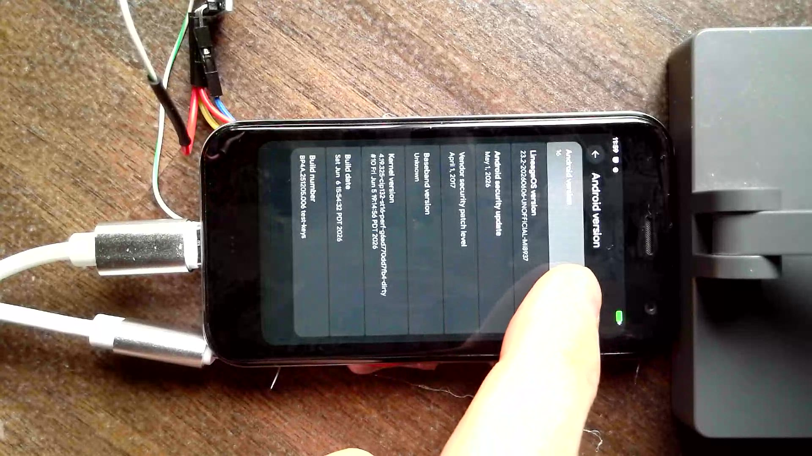
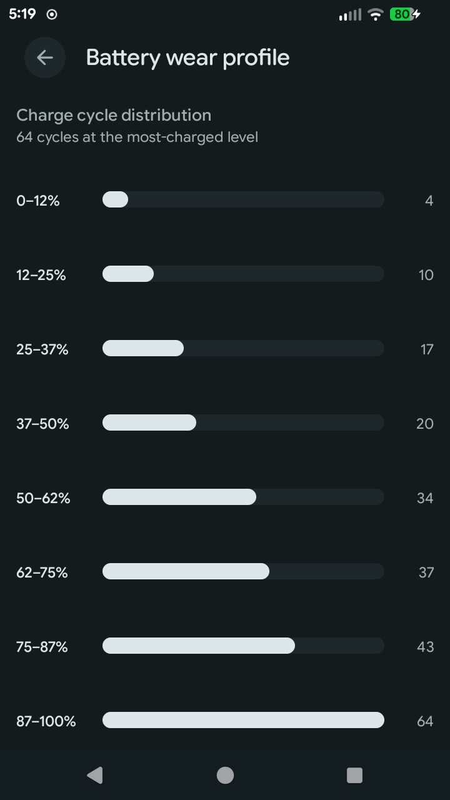
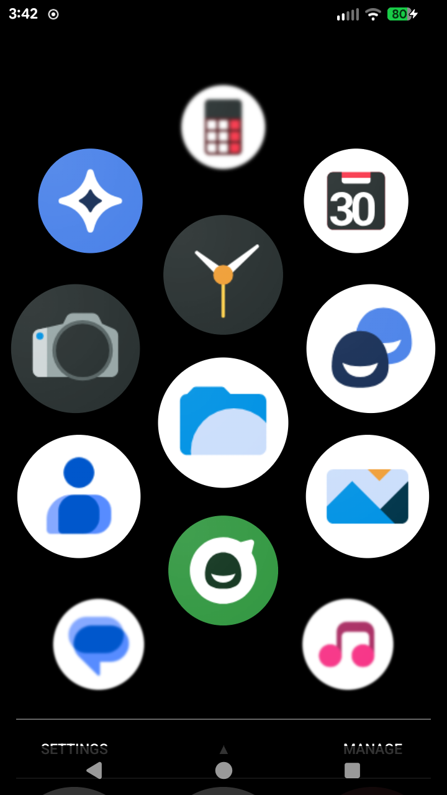

# LineageOS 23.2 for the Palm PVG100 (“pepito”)

**Android 16 on the tiny 3.3″ credit-card phone from 2018** — a full LineageOS
23.2 bring-up for the **Palm PVG100**, built as a runtime-detected variant of
the LineageOS / Mi-Thorium unified `Mi8937` tree (MSM8917/8937/8940 family),
running a 4.19 kernel where the phone shipped on 3.18.

About-phone on the PVG100: LineageOS 23.2, Android 16, kernel 4.19.325 — on
hardware that shipped Android 8.1. ▶ [Watch the Android 16 easter egg running on
it](assets/pvg100-android16-easter-egg.webm).

> **Status: pre-release.** Everything below works on the bench device; signed
> release images and pushed source branches are being finalized. This repo is
> the index — it links to every source repo carrying pepito changes and hosts
> the build instructions, screenshots, and release notes.

**Just want your PVG100 upgraded and not into the techno mumbo-jumbo?** I'll
flash Android 16 onto your phone for you for **$100** —
email [kyle@cascade.family](mailto:kyle@cascade.family).

**Want the download?** Grab the ROM and flashing instructions from the
[release page](https://github.com/solarkennedy/lineageos-pepito/releases/tag/pepito-23.2-r1) *(coming at release)*, or read the full
[bring-up write-up](https://kyle.cascade.family/posts/porting-android-16-to-a-palm-pvg100-pepito).

## Hardware

| | |
|---|---|
| SoC | Qualcomm MSM8940 (Snapdragon 435) + Adreno 505 |
| RAM / storage | 3 GB / 32 GB |
| Display | 3.3″ 720×1280, FocalTech FT8613 in-cell touch |
| Kernel | Linux 4.19.x (mainline-aligned; stock shipped 3.18) |
| Stock OS | Android 8.1 (`v1AML-0`) |

## What works

| Subsystem | Status |
|---|---|
| Telephony (SIM, LTE, calls, SMS) | ✅ incl. VoLTE — the multi-year modem blocker is solved |
| Mobile data | ✅ |
| In-call audio (earpiece / speaker / mic) | ✅ |
| Wi-Fi / Bluetooth | ✅ |
| GPS | ✅ satellite tracking; outdoor position lock is the last item on the wish list |
| Cameras (both, preview + JPEG) | ✅ |
| Sensors (all 20, incl. the Bosch BHy hub) | ✅ |
| HW video encode / decode (Venus) | ✅ |
| FBE encryption, HW Gatekeeper, TEE keys | ✅ |
| SELinux | ✅ Enforcing |

Known limitations, tracked for the [release notes](docs/RELEASE-NOTES.md):
audio DSP calibration quality (ACDB), single-SIM, the Enhanced-4G toggle is
cosmetic, no metadata encryption, and no Android Auto (the USB gadget is pinned
ADB-only, so the car can't enter accessory mode). After a fresh flash, mobile
data can come up stuck out-of-service on a neighboring carrier instead of
home network — toggle Airplane Mode once to force re-registration.

### Pepito extras

Beyond a straight port, this build brings back features the original Palm OS
had — and a few quality-of-life additions for a phone with no volume keys:

- **Face Unlock** — the original phone had it, and AOSP/LineageOS ship only a
  stub matcher. This wires in a real RGB recognition engine (a port of Paranoid
  Android's "Sense"), so you can enroll your face in Settings and unlock by
  looking at the phone. RGB-only hardware, so it's the weak "convenience" tier
  (still asks for a PIN after reboot / for payments) — the same ceiling the
  original Palm feature had.
- **Life Mode** — a quick-settings tile reviving Palm's old idea: Do Not
  Disturb plus aggressive power saving in one tap — kills the radios, drops the
  screen to greyscale, and enables battery saver. On a battery this tiny it
  meaningfully extends runtime.

  

  Battery wear profile (Settings → System): the fuel gauge's charge-cycle
  count split into eight 12.5% battery-level bands — where this pack actually
  got cycled. A pepito addition, kernel-fed from the FG's per-SoC buckets.
- **PepitoLauncher2** — a from-scratch reimplementation of the original PVG100
  home screen: a single three-column vertical drawer, no labels, with the
  macOS-dock-style lens zoom as you scroll. Decompiled from the stock app to
  match the exact lens curve and layout. Ships alongside the normal launcher —
  pick it in Settings. ([source](https://github.com/solarkennedy/PepitoLauncher2))
- **QS volume slider** — a horizontal volume slider in Quick Settings, because
  the PVG100 has no hardware volume buttons.
- **Power-key recovery navigation** — the phone has only a power button (no
  volume keys), so LineageOS recovery was patched to navigate the way stock
  did: short-press to cycle, long-press to select.

PepitoLauncher2: the interlocking three-column drawer with the lens-zoom
effect and the SETTINGS / jump / MANAGE bar, rebuilt from the stock 2018 app.

## Installation

> The PVG100 has **no Fastboot**. First-time installs go through Qualcomm
> **EDL** mode; once LineageOS recovery is on the phone, updates are a normal
> `adb sideload`. The phone is effectively unbrickable over EDL, so mistakes
> are recoverable — take a full [EDL backup](https://xdaforums.com/t/guide-using-edl-to-backup-a-palm-pvg-100-pepito-on-linux.4719549/)
> first.

**Option A — I'll do it for you ($100).** Not into flashing? Email
[kyle@cascade.family](mailto:kyle@cascade.family) and I'll upgrade your phone.

**Option B — flash the release yourself.**

1. Download the release artifact from the [release page](https://github.com/solarkennedy/lineageos-pepito/releases/tag/pepito-23.2-r1).
2. **First time from stock Android 8.1:** flash the EDL image set (bootloader,
   boot, recovery, system, vendor) with the phone in EDL mode.
   *(Detailed EDL loader + partition steps: see [BUILD.md](BUILD.md) §5 — TBD
   at release.)*
3. **Boot to recovery** by holding **Power** through 3 boot cycles.
4. **Updates / re-flash:** `adb sideload lineage-23.2-pepito-<date>.zip` from
   LineageOS recovery.
5. **First boot requires a userdata wipe** coming from stock (the switch to
   file-based encryption). Then run the setup wizard.

**Option C — build it from source.** See [BUILD.md](BUILD.md). Short form:
standard LineageOS 23.2 `repo init`, drop [`manifests/pepito.xml`](manifests/pepito.xml)
into `.repo/local_manifests/`, `repo sync`, then
`lunch lineage_Mi8937-bp4a-userdebug`. The pepito variant is runtime-detected
(`ro.vendor.xiaomi.device=pepito`), so one `lineage_Mi8937` build serves the
whole device family.

## The gory details

### The story, short version

The PVG100 never had a custom-ROM ecosystem because its 2017-era modem firmware
refuses to boot against a modern AP software stack. The root cause turned out
to be the **AP-side IPC transport**: the modem speaks the legacy Qualcomm
IPC Router (`AF_MSM_IPC`), not the modern QRTR the 4.19 kernel offers, and it
was failing *before* it ever talked to the OS. The fix was backporting the
legacy IPC stack wholesale (ipc_router core, rpmsg transport, msm QMI,
RFSA/memshare, the stock A8 `rmt_storage`) and forcing the userspace QMI
clients onto it — after which the modem announced its full 36 services and
everything riding on it (SIM, LTE, data, IMS/VoLTE, GPS) came alive.

That was the biggest fight, but every subsystem here has a story — silent
speakers routed to the wrong amp, a camera hidden behind five stacked bugs,
RPMB writes corrupted by a single SD-controller quirk, a sensor hub with no
driver anywhere. The full narrative is in the
**[bring-up write-up](https://kyle.cascade.family/posts/porting-android-16-to-a-palm-pvg100-pepito)**.

### The full record

The complete working notes — every subsystem's bring-up plan, investigation
log, and dead end — live in [plans/](plans/), included verbatim.
[plans/PLAN.md](plans/PLAN.md) is the map.

The bench build/flash tooling is in [scripts/](scripts/), including
[scripts/boot-signing/](scripts/boot-signing/) — the AVBv1 signing tool that
writes a boot image the PVG100 bootloader will actually accept (it verifies
against a leaked "verity" dev key baked into the bootloader, not stock AVB).

### Source repos

**This table is the single source of truth** for every repo carrying pepito
work — the tree path it lives at, the branch, what's in it, and the fork each
is pushed to. The linked LineageOS repos are the bases the local branches sit
on. Last surveyed 2026-07-15 — Gate 0 remote creation done (`PLAN-release.md`).

| Tree path | Base repo | Branch | Pepito work | Fork |
|---|---|---|---|---|
| `kernel/xiaomi/msm8937` | [android_kernel_xiaomi_msm8937](https://github.com/LineageOS/android_kernel_xiaomi_msm8937) | `pepito-rmnet` | 67 commits: pepito DTs, legacy-IPC backport (the modem fix), TFA9896, BHy hub, RPMB/sdhci fixes | [solarkennedy/android_kernel_xiaomi_msm8937](https://github.com/solarkennedy/android_kernel_xiaomi_msm8937) |
| `device/xiaomi/Mi8937` | [android_device_xiaomi_Mi8937](https://github.com/LineageOS/android_device_xiaomi_Mi8937) | `pepito-rmnet` | 51 commits: pepito variant — qmux radio path, audio, camera HAL, ims_enabler, sepolicy | [solarkennedy/android_device_xiaomi_Mi8937](https://github.com/solarkennedy/android_device_xiaomi_Mi8937) |
| `device/xiaomi/mithorium-common` | [android_device_xiaomi_mithorium-common](https://github.com/LineageOS/android_device_xiaomi_mithorium-common) | `pepito-rmnet` | 64 commits: shared family tree — shims, init, manifest, sepolicy | [solarkennedy/android_device_xiaomi_mithorium-common](https://github.com/solarkennedy/android_device_xiaomi_mithorium-common) |
| `bootable/recovery` | [android_bootable_recovery](https://github.com/LineageOS/android_bootable_recovery) | `lineage23-pepito` | 12 commits: power-key-only menu navigation, EDL reboot. ⚠️ carries `adbd as root` — **strip before release** | [solarkennedy/android_bootable_recovery](https://github.com/solarkennedy/android_bootable_recovery) |
| `frameworks/base` | [android_frameworks_base](https://github.com/LineageOS/android_frameworks_base) | `pepito-qs-volume-slider` | QS volume slider (SystemUI, Compose QS) | [solarkennedy/android_frameworks_base](https://github.com/solarkennedy/android_frameworks_base) |
| `lineage-sdk` | [android_lineage-sdk](https://github.com/LineageOS/android_lineage-sdk) | `pepito-qs-volume-slider` | `qs_show_volume_slider` setting + settings-DB upgrade | [solarkennedy/android_lineage-sdk](https://github.com/solarkennedy/android_lineage-sdk) |
| `packages/apps/LineageParts` | [android_packages_apps_LineageParts](https://github.com/LineageOS/android_packages_apps_LineageParts) | `pepito-lineageparts` | 11 commits: volume-slider toggle UI | [solarkennedy/android_packages_apps_LineageParts](https://github.com/solarkennedy/android_packages_apps_LineageParts) |
| `hardware/interfaces` | [android_hardware_interfaces](https://github.com/LineageOS/android_hardware_interfaces) | `pepito` | BT binary-BDADDR support, sensors HAL input group | [solarkennedy/android_hardware_interfaces](https://github.com/solarkennedy/android_hardware_interfaces) |
| `hardware/qcom-caf/bt` | [android_hardware_qcom_bt](https://github.com/LineageOS/android_hardware_qcom_bt) | `pepito` (ref; HEAD detached, matches tip) | Pronto/SMD libbt-vendor bring-up | [solarkennedy/android_hardware_qcom_bt](https://github.com/solarkennedy/android_hardware_qcom_bt) |
| `system/core` | [android_system_core](https://github.com/LineageOS/android_system_core) | `pepito` (ref; HEAD detached, matches tip) | 1 commit: silence f2fs recovery log — kept, forked for completeness | [solarkennedy/android_system_core](https://github.com/solarkennedy/android_system_core) |
| `vendor/lineage` | [android_vendor_lineage](https://github.com/LineageOS/android_vendor_lineage) | — | 0 commits — the static kernel-headers export (`726a3828`) was reverted 2026-07-15 (`cfb451c6`) and build+flash validated on the stock `generated_kernel_includes` genrule; tree is now byte-identical to upstream `lineage-23.2` | _dropped — not needed; manifest pins plain upstream_ |
| `packages/apps/PepitoLauncher2` | local `~/Projects/PepitoLauncher2` | `master` | stock-Palm-style launcher reimplementation (whole app; needs a manifest entry) | [solarkennedy/PepitoLauncher2](https://github.com/solarkennedy/PepitoLauncher2) (already existed, pushed, current) |
| — (this repo) | — | `lineageos23.2` | landing/index: README, BUILD, manifest, plans/, scripts/ incl. boot-signing | [solarkennedy/lineageos-pepito](https://github.com/solarkennedy/lineageos-pepito) (private) |
| `vendor/xiaomi` | — | `pepito-vendor` | 4 commits: curated blob trees (Mi8937 + mithorium-common), libsdm-color + libacdbloader closures. Dirty (patchelf DT_NEEDED shim edits on qcrild/IMS daemons + untracked `Mi8937/proprietary/odm/`) — not yet pushed | [solarkennedy/proprietary_vendor_xiaomi](https://github.com/solarkennedy/proprietary_vendor_xiaomi) (private) |
| `diag-tools/` | — | not a git repo | bench diagnostics — must not ship in the image | _skipped — local-only, no remote (excluded from release build)_ |

Bench-local, intentionally never pushed: `build/make` (envsetup.sh guard
against building on the netbook) and an untracked header-export artifact in
`hardware/qcom-caf/common`.

The [manifest](manifests/pepito.xml) in this repo pins the whole tree once the
forks are up — see [BUILD.md](BUILD.md).

## Credits

- **LineageOS** and the **Mi-Thorium** team — the unified MSM8937 device/kernel
  trees this build stands on.
- The postmarketOS msm89x7 work, which informed the modem bring-up.
- Palm's GPL kernel drop (incomplete, but useful).

## Disclaimer

Flashing custom firmware voids warranties and can brick devices. Nothing here
ships Palm/TCL proprietary software; vendor blobs are extracted from a device
you own. Use at your own risk.
